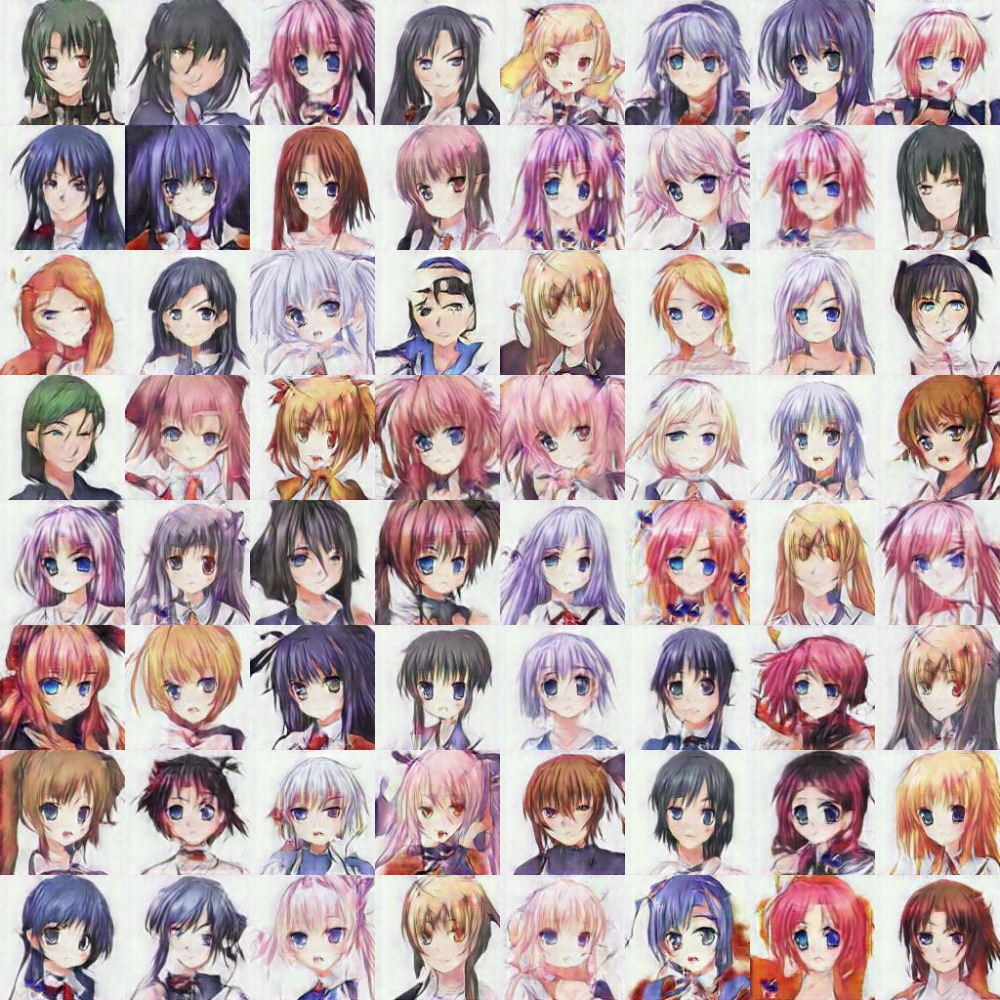
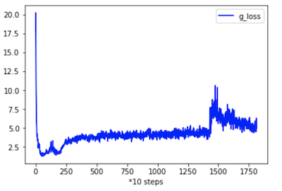
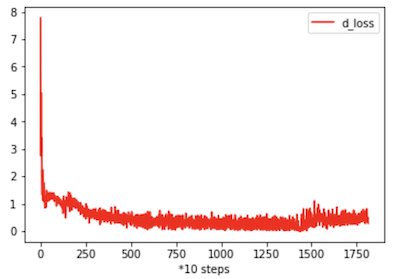

# ANIME-FACE-GAN

### Implement

#### 1. SA-GAN

https://arxiv.org/pdf/1805.08318.pdf

Implemented with Attention, Conv2DTranspose, hinge loss and spectral norm.

The SAGAN was trained in batchsize=64 and cost only 3GB GPU memory. It needs about 50000 steps for training.

#### 2. BIG-GAN

https://arxiv.org/abs/1809.11096?context=cs.LG

The BIGGAN was trained in batchsize=64 and cost 16GB GPU memory. It needs only 10000 steps for training.

### results

SAGAN 61600 steps

BIGGAN 12600 steps

### Loss

Why the generator loss is crippled in 15k steps?

### Model Records

SAGAN_V2: SAGAN + deconv

SAGAN_V3: SAGAN + deconv + bs=64 + truncated_normal

SAGAN_V4: SAGAN + upsample + bs=128 + truncated_normal

SAGAN_V5: SAGAN + deconv + bs=64 + lr_decay after 50k steps + ema for genrator

SAGAN_V6: SAGAN + deconv + bs=64 + ema for genrator

SResNetGAN_V0: SResNetGAN + pixelshuffler (failed)

SResNetGAN_V1: SResNetGAN + deconv (failed)

BIGGAN_V0: BIGGAN + generator 512

**BIGGAN_V1: BIGGAN + generator 1024 (best now!)**

### Experience

- Use truncated norm (std=0.5, truncated from -1 to 1) instead of uniform and Gaussian normal can help convergence.
- Binomial distribution works badly.
- Use Conv2DTranspose instead of Upsampling can improve the quality of images, and Upsampling also loses some diversities.
- Bigger batch size (128, 256,...) dosen't achieve better performance in this project (not sure).
- Ensure enough steps to train (at least 50k in SAGAN).
- Add ExponentialMovingAverage to the generator can improve the stability of generated images.
- It is important to remain close parameter size for both discriminator and generator.
- The residual structure and increasing the parameters scale of both discriminator and generator can improve the image details for generated results.

### Questions

- Pixelshuffle works bad (pool diversity).
- The hinge loss of discriminator usually equals 0 during the second half of training.
- The quality of the generated images rapidly falling after several steps (70k in SAGAN, 14K in BIGGAN).

### TODO

- [x] Add ExponentialMovingAverage to the generator
- [x] Learning rate exponentially decease after 50000 iterations of training (failed, not sure).
- [ ] Add labels from illustration2vec.

